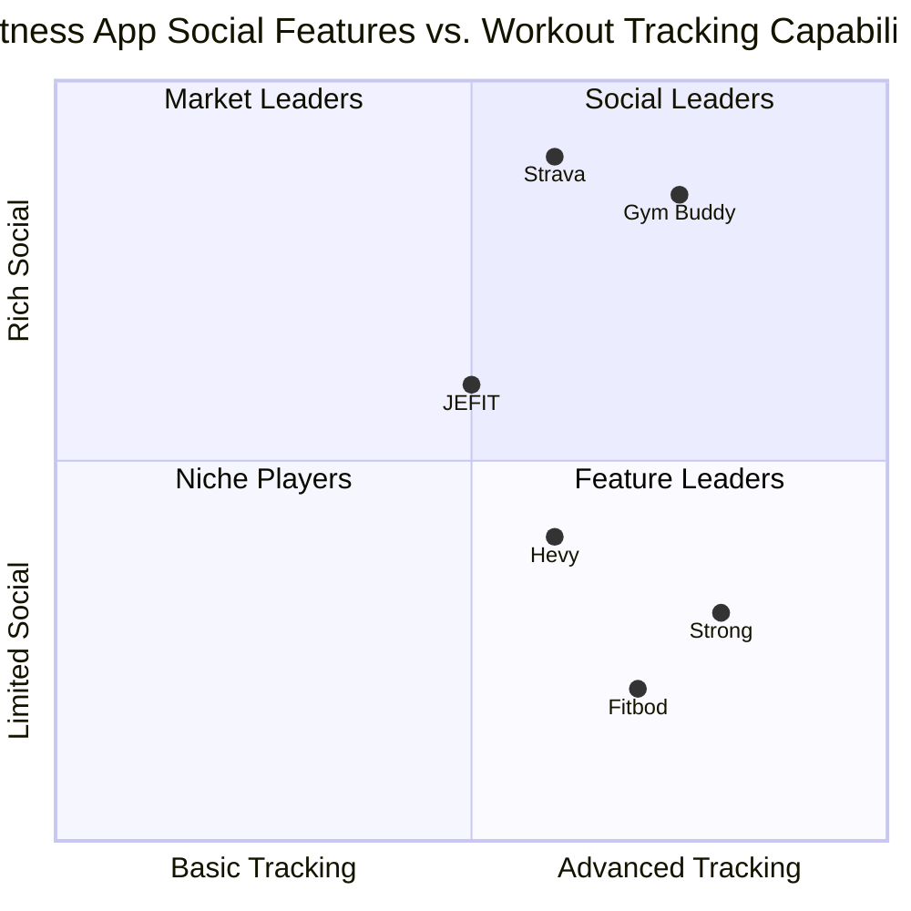

# Gym Buddy - Social Fitness Tracking Application PRD

## 1. Project Overview

### 1.1 Project Information
- **Project Name**: gym_buddy
- **Technology Stack**: React, JavaScript, Tailwind CSS, Supabase
- **Development Methodology**: Agile/Scrum with 2-week sprints
- **Original Requirements**: Create a gym tracking application with social features, authentication, and gamification elements similar to BeReal but focused on fitness.

### 1.2 Product Goals
1. Create an engaging fitness community platform that encourages consistent workout habits through social interaction
2. Provide comprehensive workout tracking capabilities with an intuitive user interface
3. Drive user engagement through gamification and social features that promote accountability

### 1.3 User Stories
1. As a fitness enthusiast, I want to track my workouts and share them with my gym community so that I can stay motivated and accountable
2. As a gym member, I want to join workout groups and see my friends' exercises so that I can feel connected and inspired
3. As a regular user, I want to maintain my workout streak and earn achievements so that I stay motivated to continue my fitness journey
4. As a social user, I want to engage with my friends' workouts through comments and reactions so that I can provide support and encouragement

### 1.4 Competitive Analysis

1. **Strava**
   - Pros:
     * Strong community features
     * Comprehensive activity tracking
     * Well-established user base (125M+ users)
   - Cons:
     * Primarily focused on cardio activities
     * Complex interface for beginners
     * Limited gym workout tracking

2. **Strong**
   - Pros:
     * Detailed workout tracking
     * Exercise library
     * Clean interface
   - Cons:
     * Limited social features
     * Basic progress tracking
     * No gamification

3. **Fitbod**
   - Pros:
     * AI-powered workout recommendations
     * Detailed exercise instructions
     * Recovery tracking
   - Cons:
     * No social features
     * Expensive subscription
     * Limited customization

4. **JEFIT**
   - Pros:
     * Extensive exercise library
     * Community features
     * Workout planning
   - Cons:
     * Cluttered interface
     * Limited free features
     * Basic social interaction

5. **Hevy**
   - Pros:
     * Clean workout tracking
     * Basic social features
     * Good exercise logging
   - Cons:
     * Limited community engagement
     * Basic progress visualization
     * No gamification

### 1.5 Competitive Positioning

## 2. Technical Specifications

### 2.1. Technology Stack Details

#### 2.1.1 Frontend
- **Framework**: React 18.x with functional components and hooks
- **State Management**: React Context API for local state, Redux Toolkit for global state
- **Styling**: Tailwind CSS with custom theme configuration
- **UI Components**: Custom components with Headless UI for accessibility
- **Routing**: React Router v6.x for navigation
- **Form Handling**: React Hook Form with Yup validation
- **Testing**: Jest and React Testing Library

#### 2.1.2 Backend
- **Database**: PostgreSQL via Supabase
- **Authentication**: Supabase Auth with Gmail OAuth integration
- **Storage**: Supabase Storage for user-generated content
- **Realtime**: Supabase Realtime for live updates
- **API**: RESTful endpoints via Supabase Functions

#### 2.1.3 DevOps
- **Version Control**: Git with GitHub
- **CI/CD**: GitHub Actions
- **Deployment**: Vercel for frontend, Supabase for backend
- **Monitoring**: Sentry for error tracking, Google Analytics for usage metrics

### 2.2 Database Schema

#### 2.2.1 Core Tables

1. **users**
   - id (PK)
   - email
   - username
   - full_name
   - avatar_url
   - bio
   - created_at
   - updated_at
   - last_login
   - preferences (JSONB)

2. **exercises**
   - id (PK)
   - name
   - description
   - muscle_group
   - equipment_needed
   - difficulty_level
   - instructions
   - video_url
   - is_custom (boolean)
   - created_by (FK to users)
   - created_at
   - updated_at

3. **workouts**
   - id (PK)
   - user_id (FK to users)
   - title
   - description
   - duration
   - location
   - is_public (boolean)
   - image_url
   - created_at
   - updated_at

4. **workout_exercises**
   - id (PK)
   - workout_id (FK to workouts)
   - exercise_id (FK to exercises)
   - order_index
   - notes

5. **workout_sets**
   - id (PK)
   - workout_exercise_id (FK to workout_exercises)
   - weight
   - reps
   - duration
   - distance
   - unit_system (imperial/metric)
   - order_index
   - is_completed (boolean)

#### 2.2.2 Social Tables

1. **friends**
   - id (PK)
   - user_id (FK to users)
   - friend_id (FK to users)
   - status (pending, accepted, blocked)
   - created_at
   - updated_at

2. **groups**
   - id (PK)
   - name
   - description
   - avatar_url
   - privacy_level (public, private, secret)
   - created_by (FK to users)
   - created_at
   - updated_at

3. **group_members**
   - id (PK)
   - group_id (FK to groups)
   - user_id (FK to users)
   - role (admin, moderator, member)
   - joined_at

4. **posts**
   - id (PK)
   - user_id (FK to users)
   - workout_id (FK to workouts, nullable)
   - group_id (FK to groups, nullable)
   - content
   - image_url
   - created_at
   - updated_at

5. **comments**
   - id (PK)
   - post_id (FK to posts)
   - user_id (FK to users)
   - content
   - created_at
   - updated_at

6. **reactions**
   - id (PK)
   - user_id (FK to users)
   - entity_type (post, comment)
   - entity_id
   - reaction_type (like, fire, clap, etc.)
   - created_at

#### 2.2.3 Gamification Tables

1. **streaks**
   - id (PK)
   - user_id (FK to users)
   - current_streak
   - longest_streak
   - last_workout_date
   - updated_at

2. **achievements**
   - id (PK)
   - name
   - description
   - icon_url
   - achievement_type
   - threshold
   - created_at

3. **user_achievements**
   - id (PK)
   - user_id (FK to users)
   - achievement_id (FK to achievements)
   - progress
   - is_completed (boolean)
   - completed_at
   - created_at
   - updated_at

4. **challenges**
   - id (PK)
   - title
   - description
   - start_date
   - end_date
   - challenge_type
   - goal_value
   - created_by (FK to users)
   - group_id (FK to groups, nullable)
   - is_public (boolean)
   - created_at
   - updated_at

5. **challenge_participants**
   - id (PK)
   - challenge_id (FK to challenges)
   - user_id (FK to users)
   - current_progress
   - joined_at
   - completed_at

### 2.3 API Endpoints

#### 2.3.1 Authentication
- `POST /auth/signup` - Register new user
- `POST /auth/login` - Login user
- `POST /auth/logout` - Logout user
- `GET /auth/user` - Get current user
- `PUT /auth/user` - Update user profile
- `POST /auth/password-reset` - Request password reset

#### 2.3.2 Exercises
- `GET /exercises` - List exercises with filtering options
- `GET /exercises/:id` - Get exercise details
- `POST /exercises` - Create custom exercise
- `PUT /exercises/:id` - Update exercise
- `DELETE /exercises/:id` - Delete custom exercise

#### 2.3.3 Workouts
- `GET /workouts` - List user workouts
- `GET /workouts/:id` - Get workout details
- `POST /workouts` - Create workout
- `PUT /workouts/:id` - Update workout
- `DELETE /workouts/:id` - Delete workout
- `POST /workouts/:id/complete` - Mark workout as completed
- `POST /workouts/:id/share` - Share workout to feed/group

#### 2.3.4 Social
- `GET /friends` - List friends
- `POST /friends/request/:userId` - Send friend request
- `PUT /friends/request/:requestId` - Accept/reject friend request
- `DELETE /friends/:friendId` - Remove friend
- `GET /groups` - List groups
- `GET /groups/:id` - Get group details
- `POST /groups` - Create group
- `PUT /groups/:id` - Update group
- `DELETE /groups/:id` - Delete group
- `POST /groups/:id/join` - Join/request to join group
- `GET /feed` - Get activity feed
- `POST /posts` - Create post
- `DELETE /posts/:id` - Delete post
- `POST /posts/:id/comments` - Add comment
- `POST /posts/:id/reactions` - Add reaction

#### 2.3.5 Gamification
- `GET /streaks` - Get user streak info
- `GET /achievements` - List achievements
- `GET /achievements/:id` - Get achievement details
- `GET /user/achievements` - Get user's achievements
- `GET /challenges` - List available challenges
- `POST /challenges` - Create challenge
- `POST /challenges/:id/join` - Join challenge
- `GET /challenges/:id/leaderboard` - Get challenge leaderboard

### 2.4 Frontend Architecture

#### 2.4.1 Component Structure
- **Layouts**
  - MainLayout (with bottom navigation)
  - AuthLayout
  - ModalLayout
  
- **Pages**
  - Authentication (Login, Register, ForgotPassword)
  - Feed
  - Workout (Create, View, History)
  - Calendar
  - Groups (List, Detail, Create)
  - Profile (Personal, User)
  - Settings
  
- **Core Components**
  - Navigation (BottomNav, TopBar)
  - Feed (PostCard, CommentSection)
  - Workout (ExerciseCard, SetTracker)
  - Forms (InputField, SelectField, Toggle)
  - User (Avatar, UserBadge, AchievementBadge)
  - Modals (ConfirmationModal, MediaUploadModal)

#### 2.4.2 State Management
- **Global State** (Redux)
  - User authentication state
  - App settings
  - Notification state
  
- **Context API**
  - Workout tracking state
  - Form states
  - Modal controllers
  
- **Local Component State**
  - UI interactions
  - Form validations
  - Component-specific data

#### 2.4.3 Routes Structure
- `/` - Home/Feed
- `/auth` - Authentication routes
  - `/auth/login`
  - `/auth/register`
  - `/auth/forgot-password`
- `/workout` - Workout routes
  - `/workout/new`
  - `/workout/:id`
  - `/workout/history`
- `/calendar` - Calendar view
- `/groups` - Groups routes
  - `/groups/discover`
  - `/groups/:id`
  - `/groups/create`
- `/profile` - Profile routes
  - `/profile/me`
  - `/profile/:userId`
- `/settings` - Settings and preferences

## 3. Implementation Plan and Task Breakdown

### Phase 1: Foundation (2 Sprints)

#### Sprint 1: Project Setup & Authentication

##### 1.1 Project Configuration
- [ ] 1.1.1 Initialize React project with Create React App or Vite
  - [ ] Setup folder structure (components, pages, hooks, utils, services)
  - [ ] Configure Tailwind CSS with custom theme
  - [ ] Setup ESLint and Prettier
  - [ ] Configure testing environment
- [ ] 1.1.2 Setup Supabase project
  - [ ] Create project in Supabase dashboard
  - [ ] Configure database access policies
  - [ ] Setup storage buckets with permissions
- [ ] 1.1.3 Configure CI/CD pipeline
  - [ ] Setup GitHub repository
  - [ ] Configure GitHub Actions for testing
  - [ ] Setup Vercel project for deployment

##### 1.2 Authentication System
- [ ] 1.2.1 Implement Supabase Auth context
  - [ ] Create auth provider component
  - [ ] Implement auth state management
  - [ ] Setup protected routes system
- [ ] 1.2.2 Build login page
  - [ ] Create form with email/password inputs
  - [ ] Implement form validation
  - [ ] Add error handling and feedback
  - [ ] Create "Remember me" functionality
- [ ] 1.2.3 Build registration page
  - [ ] Create form with required fields
  - [ ] Implement email verification process
  - [ ] Add terms of service acceptance
- [ ] 1.2.4 Implement Google OAuth integration
  - [ ] Configure Supabase OAuth settings
  - [ ] Create Google OAuth button component
  - [ ] Handle OAuth redirect and callbacks
- [ ] 1.2.5 Build password reset functionality
  - [ ] Create forgot password form
  - [ ] Implement reset password logic
  - [ ] Design and implement email templates

##### 1.3 Core Navigation & Structure
- [ ] 1.3.1 Create main app layout
  - [ ] Build responsive container structures
  - [ ] Implement header component with user menu
  - [ ] Create loading and error states
- [ ] 1.3.2 Implement bottom navigation bar
  - [ ] Design and build navigation items
  - [ ] Add active state indicators
  - [ ] Create responsive behavior
- [ ] 1.3.3 Build routing structure
  - [ ] Configure React Router
  - [ ] Implement route guards for authentication
  - [ ] Setup lazy loading for performance

#### Sprint 2: User Profile & Basic Exercise Management

##### 2.1 User Profile
- [ ] 2.1.1 Create profile database schema
  - [ ] Configure user table extensions
  - [ ] Create database triggers for profile updates
  - [ ] Setup row-level security policies
- [ ] 2.1.2 Build profile page UI
  - [ ] Create user info section
  - [ ] Build avatar component with upload capability
  - [ ] Design profile stats display
- [ ] 2.1.3 Implement profile editing
  - [ ] Create edit profile form
  - [ ] Build image cropping component
  - [ ] Implement form validation and submission
- [ ] 2.1.4 Add profile privacy settings
  - [ ] Create privacy toggles UI
  - [ ] Implement privacy settings logic
  - [ ] Update database security policies

##### 2.2 Exercise Library
- [ ] 2.2.1 Create exercise database schema
  - [ ] Design exercise and categories tables
  - [ ] Create relationships and constraints
  - [ ] Populate with initial exercise data
- [ ] 2.2.2 Build exercise browse UI
  - [ ] Create exercise card component
  - [ ] Implement filter and search functionality
  - [ ] Add category navigation
- [ ] 2.2.3 Implement exercise detail view
  - [ ] Design exercise information layout
  - [ ] Create instruction steps component
  - [ ] Add related exercises section
- [ ] 2.2.4 Add custom exercise creation
  - [ ] Build exercise creation form
  - [ ] Implement image/video upload
  - [ ] Create validation and submission logic

##### 2.3 Settings & Preferences
- [ ] 2.3.1 Create settings database schema
  - [ ] Design preferences table structure
  - [ ] Create notification settings schema
  - [ ] Setup default preferences
- [ ] 2.3.2 Build settings page UI
  - [ ] Create settings categories navigation
  - [ ] Build toggle and select components
  - [ ] Implement form submission
- [ ] 2.3.3 Add notification preferences
  - [ ] Create notification types UI
  - [ ] Implement preference saving logic
  - [ ] Test notification triggers

### Phase 2: Core Functionality (3 Sprints)

#### Sprint 3: Workout Tracking Core

##### 3.1 Workout Creation System
- [ ] 3.1.1 Create workout database schema
  - [ ] Design workouts, exercises, and sets tables
  - [ ] Implement proper relationships and constraints
  - [ ] Setup data validation rules
- [ ] 3.1.2 Build workout creation flow
  - [ ] Create multi-step workout builder
  - [ ] Implement exercise search and selection
  - [ ] Build set and rep tracking interface
- [ ] 3.1.3 Add workout templates
  - [ ] Create template database structure
  - [ ] Build template creation UI
  - [ ] Implement template selection and application
- [ ] 3.1.4 Implement workout notes and media
  - [ ] Add notes field to workout schema
  - [ ] Create media upload component
  - [ ] Implement image processing and storage

##### 3.2 Active Workout Interface
- [ ] 3.2.1 Build workout timer
  - [ ] Create timer component with controls
  - [ ] Implement rest timer functionality
  - [ ] Add timer notifications
- [ ] 3.2.2 Create set tracking interface
  - [ ] Design set input components
  - [ ] Build weight/reps/duration trackers
  - [ ] Implement set completion logic
- [ ] 3.2.3 Add exercise switching
  - [ ] Create exercise list navigation
  - [ ] Build exercise progress indicator
  - [ ] Implement swipe gestures for navigation
- [ ] 3.2.4 Implement workout completion
  - [ ] Create workout summary view
  - [ ] Build completion celebration animation
  - [ ] Add workout sharing option

##### 3.3 Workout History & Stats
- [ ] 3.3.1 Create workout history view
  - [ ] Build filterable workout list
  - [ ] Create workout card component
  - [ ] Implement date range selection
- [ ] 3.3.2 Add detailed workout view
  - [ ] Design workout details layout
  - [ ] Create exercise performance display
  - [ ] Build comparison with previous workouts
- [ ] 3.3.3 Implement basic analytics
  - [ ] Create volume and frequency charts
  - [ ] Build strength progression graphs
  - [ ] Implement personal records tracking

#### Sprint 4: Calendar & Scheduling

##### 4.1 Calendar Interface
- [ ] 4.1.1 Create calendar database schema
  - [ ] Design scheduled workouts table
  - [ ] Implement recurring workouts logic
  - [ ] Create calendar event triggers
- [ ] 4.1.2 Build calendar view
  - [ ] Create month view component
  - [ ] Implement day view with time slots
  - [ ] Add workout indicators on calendar
- [ ] 4.1.3 Create workout scheduling
  - [ ] Build date/time selection interface
  - [ ] Implement template selection for scheduling
  - [ ] Add recurring workout options
- [ ] 4.1.4 Implement schedule notifications
  - [ ] Create notification system architecture
  - [ ] Build reminder configuration UI
  - [ ] Implement notification scheduling

##### 4.2 Streak Tracking
- [ ] 4.2.1 Create streak database schema
  - [ ] Design streak tracking table
  - [ ] Implement streak calculation logic
  - [ ] Create streak update triggers
- [ ] 4.2.2 Build streak visualization
  - [ ] Create streak counter component
  - [ ] Build calendar heatmap display
  - [ ] Implement streak milestone indicators
- [ ] 4.2.3 Add streak notifications
  - [ ] Create streak milestone alerts
  - [ ] Implement streak maintenance reminders
  - [ ] Build streak recovery notifications

##### 4.3 Progress Tracking
- [ ] 4.3.1 Create body metrics tracking
  - [ ] Design metrics database schema
  - [ ] Build metrics input forms
  - [ ] Create metrics visualization charts
- [ ] 4.3.2 Implement personal records
  - [ ] Design PR tracking system
  - [ ] Create PR detection logic
  - [ ] Build PR celebration component
- [ ] 4.3.3 Add progress photos
  - [ ] Create photo storage structure
  - [ ] Build photo capture interface
  - [ ] Implement photo comparison tool

#### Sprint 5: Basic Social Features

##### 5.1 Friend System
- [ ] 5.1.1 Create friend database schema
  - [ ] Design friend relationships table
  - [ ] Implement friend request logic
  - [ ] Create privacy constraints
- [ ] 5.1.2 Build friend discovery UI
  - [ ] Create user search functionality
  - [ ] Build suggested friends component
  - [ ] Implement user cards
- [ ] 5.1.3 Implement friend requests
  - [ ] Create request sending interface
  - [ ] Build request notification system
  - [ ] Implement accept/reject logic
- [ ] 5.1.4 Add friend management
  - [ ] Create friends list view
  - [ ] Build unfriend functionality
  - [ ] Implement blocking capability

##### 5.2 Activity Feed
- [ ] 5.2.1 Create posts database schema
  - [ ] Design posts and interactions tables
  - [ ] Implement content relationships
  - [ ] Setup security policies
- [ ] 5.2.2 Build feed UI
  - [ ] Create post card component
  - [ ] Implement infinite scroll
  - [ ] Add pull-to-refresh functionality
- [ ] 5.2.3 Implement post creation
  - [ ] Build post composer with media upload
  - [ ] Create workout sharing integration
  - [ ] Implement post privacy options
- [ ] 5.2.4 Add interactions (likes, comments)
  - [ ] Create reaction button component
  - [ ] Build comments section UI
  - [ ] Implement notification triggers

##### 5.3 Basic Groups
- [ ] 5.3.1 Create groups database schema
  - [ ] Design groups and membership tables
  - [ ] Implement role-based permissions
  - [ ] Setup group privacy options
- [ ] 5.3.2 Build group discovery UI
  - [ ] Create group browsing interface
  - [ ] Implement search and filtering
  - [ ] Build group card component
- [ ] 5.3.3 Implement group creation
  - [ ] Create group setup form
  - [ ] Build group avatar upload
  - [ ] Implement group settings configuration
- [ ] 5.3.4 Add basic group functionality
  - [ ] Create group member management
  - [ ] Build group feed component
  - [ ] Implement join/leave functions

### Phase 3: Advanced Features (3 Sprints)

#### Sprint 6: Enhanced Social Features

##### 6.1 Real-time Workout Sharing
- [ ] 6.1.1 Implement Supabase Realtime subscriptions
  - [ ] Configure realtime channels
  - [ ] Create subscription handlers
  - [ ] Implement presence indicators
- [ ] 6.1.2 Build live workout sharing
  - [ ] Create timed workout notification
  - [ ] Build workout livestream component
  - [ ] Implement live interaction capabilities
- [ ] 6.1.3 Add workout reaction system
  - [ ] Create reaction animations
  - [ ] Implement interactive emoji picker
  - [ ] Build realtime reaction counters
- [ ] 6.1.4 Implement privacy controls
  - [ ] Create audience selection interface
  - [ ] Build location privacy options
  - [ ] Implement block and restrict functions

##### 6.2 Advanced Group Features
- [ ] 6.2.1 Add group roles and permissions
  - [ ] Create role management interface
  - [ ] Implement permission-based actions
  - [ ] Build admin control panel
- [ ] 6.2.2 Create group media galleries
  - [ ] Design gallery database schema
  - [ ] Build photo/video gallery component
  - [ ] Implement media upload and browsing
- [ ] 6.2.3 Add group messaging
  - [ ] Create group chat database schema
  - [ ] Build chat interface component
  - [ ] Implement realtime messaging
- [ ] 6.2.4 Implement group events
  - [ ] Create event database schema
  - [ ] Build event creation interface
  - [ ] Implement RSVP and reminder system

##### 6.3 Content Moderation
- [ ] 6.3.1 Create reporting system
  - [ ] Design report database schema
  - [ ] Build report submission interface
  - [ ] Implement report review workflow
- [ ] 6.3.2 Add content filtering
  - [ ] Implement text-based content filtering
  - [ ] Create image moderation system
  - [ ] Build inappropriate content detection
- [ ] 6.3.3 Implement user moderation tools
  - [ ] Create user restrictions interface
  - [ ] Build temporary timeout functionality
  - [ ] Implement appeals process

#### Sprint 7: Gamification Systems

##### 7.1 Achievements
- [ ] 7.1.1 Create achievement database schema
  - [ ] Design achievements and progress tables
  - [ ] Implement achievement triggers
  - [ ] Create achievement categories
- [ ] 7.1.2 Build achievement tracking system
  - [ ] Create achievement progress calculators
  - [ ] Implement milestone detection
  - [ ] Build notification triggers
- [ ] 7.1.3 Add achievement display
  - [ ] Create achievement badge components
  - [ ] Build achievements showcase UI
  - [ ] Implement unlocking animation
- [ ] 7.1.4 Create achievement collections
  - [ ] Design collection database schema
  - [ ] Build collection progress visualization
  - [ ] Implement special rewards for collections

##### 7.2 Challenges
- [ ] 7.2.1 Create challenge database schema
  - [ ] Design challenges and participants tables
  - [ ] Implement progress tracking logic
  - [ ] Create challenge types
- [ ] 7.2.2 Build challenge creation interface
  - [ ] Create challenge setup form
  - [ ] Build goal and rules configuration
  - [ ] Implement invitation system
- [ ] 7.2.3 Add challenge participation UI
  - [ ] Create join flow with confirmation
  - [ ] Build progress tracking visualization
  - [ ] Implement leaderboard component
- [ ] 7.2.4 Create challenge rewards
  - [ ] Design rewards system
  - [ ] Build achievement integration
  - [ ] Implement badge distribution

##### 7.3 Levels and Progression
- [ ] 7.3.1 Create level system database schema
  - [ ] Design user experience and level tables
  - [ ] Implement XP calculation logic
  - [ ] Create level-up triggers
- [ ] 7.3.2 Build level visualization
  - [ ] Create level indicator component
  - [ ] Build XP progress bar
  - [ ] Implement level-up animation
- [ ] 7.3.3 Add activity-based rewards
  - [ ] Design reward distribution system
  - [ ] Create special perks for higher levels
  - [ ] Implement milestone celebrations

#### Sprint 8: Premium Features & Polish

##### 8.1 Advanced Analytics
- [ ] 8.1.1 Create analytics database views
  - [ ] Design aggregation queries
  - [ ] Implement data processing functions
  - [ ] Create historical comparisons
- [ ] 8.1.2 Build analytics dashboard
  - [ ] Create chart components
  - [ ] Build comparison tools
  - [ ] Implement custom date range selection
- [ ] 8.1.3 Add performance insights
  - [ ] Create trend detection algorithms
  - [ ] Build recommendation engine
  - [ ] Implement insight notifications
- [ ] 8.1.4 Create export functionality
  - [ ] Design data export formats
  - [ ] Build export selection interface
  - [ ] Implement download mechanisms

##### 8.2 Custom Templates and Workouts
- [ ] 8.2.1 Enhance template system
  - [ ] Add template categories
  - [ ] Implement template sharing
  - [ ] Create template library
- [ ] 8.2.2 Build advanced exercise customization
  - [ ] Create exercise variation builder
  - [ ] Implement custom fields
  - [ ] Build exercise grouping
- [ ] 8.2.3 Add workout program builder
  - [ ] Create program database schema
  - [ ] Build program designer interface
  - [ ] Implement program progression logic

##### 8.3 Subscription System
- [ ] 8.3.1 Create subscription infrastructure
  - [ ] Set up payment processor integration
  - [ ] Design subscription tiers
  - [ ] Implement feature flags
- [ ] 8.3.2 Build subscription UI
  - [ ] Create plan comparison page
  - [ ] Build subscription management interface
  - [ ] Implement upgrade/downgrade flows
- [ ] 8.3.3 Add payment processing
  - [ ] Implement secure checkout flow
  - [ ] Create receipt and invoice system
  - [ ] Build payment history display

### Phase 4: Refinement & Launch (2 Sprints)

#### Sprint 9: Performance Optimization & Testing

##### 9.1 Performance Optimization
- [ ] 9.1.1 Implement code splitting
  - [ ] Configure dynamic imports
  - [ ] Optimize bundle size
  - [ ] Add loading indicators
- [ ] 9.1.2 Improve image optimization
  - [ ] Implement responsive images
  - [ ] Create image compression pipeline
  - [ ] Add lazy loading for media
- [ ] 9.1.3 Enhance database performance
  - [ ] Create optimized indexes
  - [ ] Implement query caching
  - [ ] Optimize data access patterns
- [ ] 9.1.4 Add offline capabilities
  - [ ] Implement service worker
  - [ ] Create offline data synchronization
  - [ ] Build offline UI indicators

##### 9.2 Testing & Quality Assurance
- [ ] 9.2.1 Implement unit testing
  - [ ] Create test suites for components
  - [ ] Build service function tests
  - [ ] Implement utility function tests
- [ ] 9.2.2 Add integration testing
  - [ ] Create user flow tests
  - [ ] Build API integration tests
  - [ ] Implement form submission tests
- [ ] 9.2.3 Perform end-to-end testing
  - [ ] Create critical path test scenarios
  - [ ] Build authentication test flows
  - [ ] Implement cross-browser testing
- [ ] 9.2.4 Conduct accessibility testing
  - [ ] Implement keyboard navigation
  - [ ] Add screen reader compatibility
  - [ ] Ensure color contrast compliance

##### 9.3 Security Enhancements
- [ ] 9.3.1 Perform security audit
  - [ ] Review authentication flows
  - [ ] Audit data access policies
  - [ ] Check for common vulnerabilities
- [ ] 9.3.2 Implement additional security measures
  - [ ] Add rate limiting
  - [ ] Implement input sanitization
  - [ ] Create security headers
- [ ] 9.3.3 Add privacy features
  - [ ] Create data export tool
  - [ ] Build account deletion function
  - [ ] Implement data retention policies

#### Sprint 10: Final Polish & Launch Preparation

##### 10.1 UI/UX Polish
- [ ] 10.1.1 Enhance animations and transitions
  - [ ] Refine page transitions
  - [ ] Optimize loading states
  - [ ] Improve micro-interactions
- [ ] 10.1.2 Implement responsive design improvements
  - [ ] Optimize for various mobile devices
  - [ ] Add tablet-specific layouts
  - [ ] Ensure desktop compatibility
- [ ] 10.1.3 Conduct usability testing
  - [ ] Create user testing scenarios
  - [ ] Gather and analyze feedback
  - [ ] Implement high-priority UX fixes

##### 10.2 Content Preparation
- [ ] 10.2.1 Create onboarding content
  - [ ] Design welcome screens
  - [ ] Build tutorial walkthroughs
  - [ ] Create help documentation
- [ ] 10.2.2 Prepare initial exercise library
  - [ ] Finalize exercise database
  - [ ] Ensure all exercises have proper descriptions
  - [ ] Add high-quality exercise images
- [ ] 10.2.3 Create sample workout templates
  - [ ] Design beginner workout templates
  - [ ] Create intermediate program templates
  - [ ] Build advanced specialized templates

##### 10.3 Launch Preparation
- [ ] 10.3.1 Implement analytics tracking
  - [ ] Configure Google Analytics events
  - [ ] Setup conversion tracking
  - [ ] Create custom dashboards
- [ ] 10.3.2 Prepare beta testing program
  - [ ] Create beta tester recruitment form
  - [ ] Build feedback collection system
  - [ ] Implement controlled rollout mechanism
- [ ] 10.3.3 Configure monitoring and alerts
  - [ ] Setup error tracking and reporting
  - [ ] Implement performance monitoring
  - [ ] Create alert thresholds and notifications
- [ ] 10.3.4 Finalize deployment pipeline
  - [ ] Test production deployment
  - [ ] Create rollback procedures
  - [ ] Finalize database migration scripts

## 4. Business Value

### 4.1 Market Opportunity
- Social fitness app market valued at $3.5B in 2024
- Over 30% of users prefer digital fitness platforms
- Growing demand for social accountability in fitness

### 4.2 Unique Value Proposition
- Combines serious workout tracking with engaging social features
- Real-time workout sharing creates authentic connections
- Gamification elements drive consistent user engagement
- Focus on building smaller, more meaningful fitness communities

### 4.3 Monetization Strategy
- Freemium model with basic features free
- Premium features including:
  * Advanced analytics and insights
  * Unlimited workout templates
  * Custom challenges and leaderboards
  * Ad-free experience
  * Extended workout history
  * Priority support

### 4.4 Success Metrics

#### 4.4.1 Acquisition Metrics
- New user sign-ups per day/week/month
- User acquisition cost (UAC)
- Channel effectiveness (organic vs. paid)
- Sign-up completion rate
- Onboarding completion rate

#### 4.4.2 Engagement Metrics
- Daily/weekly active users (DAU/WAU)
- Average session duration
- Session frequency
- Feature adoption rates
- Workout completion rates
- Social interaction metrics (posts, comments, likes)

#### 4.4.3 Retention Metrics
- Day 1, 7, 30 retention rates
- Churn rate
- Resurrection rate (returning users)
- Streak maintenance statistics
- Long-term retention cohort analysis

#### 4.4.4 Business Metrics
- Premium conversion rate
- Average revenue per user (ARPU)
- Monthly recurring revenue (MRR)
- Customer lifetime value (LTV)
- LTV:CAC ratio

## 5. Technical Dependencies and Risk Assessment

### 5.1 Critical Dependencies

#### 5.1.1 Core Path Dependencies
1. Authentication system must be completed before any user-specific features
2. Exercise library must be implemented before workout creation
3. Workout tracking system must precede social sharing features
4. Basic friend system required before social feed
5. Streak tracking relies on completed workout history

#### 5.1.2 External Dependencies
1. Supabase platform availability and API stability
2. React and other key libraries version compatibility
3. Mobile browser compatibility with camera/media APIs
4. OAuth provider policies (Google)
5. Payment processor integration requirements

### 5.2 Risk Assessment and Mitigation

#### 5.2.1 Technical Risks
| Risk | Impact | Probability | Mitigation |
|------|--------|------------|------------|
| Supabase service disruption | High | Low | Implement robust error handling and offline capabilities |
| Performance issues with large workout histories | Medium | Medium | Design efficient database queries and implement pagination |
| Real-time functionality scalability | Medium | Medium | Utilize connection pooling and optimize subscription patterns |
| Media storage costs exceeding budget | Medium | Medium | Implement image compression and storage quotas |
| Browser compatibility issues | Medium | Low | Establish browser support matrix and test across platforms |

#### 5.2.2 Product Risks
| Risk | Impact | Probability | Mitigation |
|------|--------|------------|------------|
| Low user engagement | High | Medium | Implement robust onboarding and engagement hooks |
| Feature creep delaying launch | Medium | High | Strict prioritization and MVP definition |
| Poor retention after initial signup | High | Medium | Focus on core value delivery and engagement loops |
| User privacy concerns | Medium | Low | Clear privacy policies and granular privacy controls |
| Competition from established fitness apps | Medium | High | Focus on unique differentiators and community aspects |

## 6. Appendix

### 6.1 Glossary of Terms
- **Workout**: A single exercise session tracked by the user
- **Exercise**: A specific physical activity with defined parameters
- **Set**: A group of repetitions of an exercise
- **Rep**: A single execution of an exercise movement
- **Streak**: Consecutive days/periods with completed workouts
- **PR (Personal Record)**: User's best performance for a specific exercise
- **Group**: A collection of users with shared interests or goals
- **Challenge**: A time-bound goal with specific exercise criteria
- **Achievement**: A recognition awarded for reaching specific milestones
- **Template**: A pre-defined workout structure that can be reused

### 6.2 Technical Resources
- React Documentation: https://reactjs.org/docs
- Tailwind CSS: https://tailwindcss.com/docs
- Supabase Documentation: https://supabase.io/docs
- React Hook Form: https://react-hook-form.com/
- React Router: https://reactrouter.com/